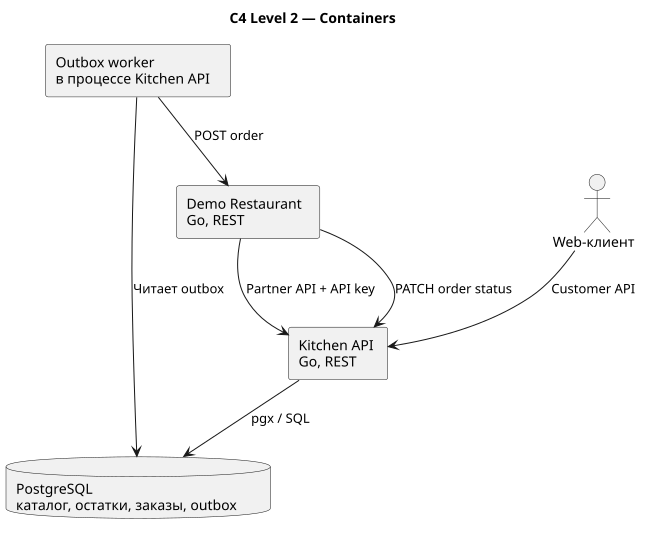

<h1 align="center">Restaurant Delivery Platform</h1>

<p align="center">
  Backend-платформа для автоматизации заказов и доставки еды из ресторанов<br>
  <strong>Go · React · TypeScript · PostgreSQL · SSE · Transactional Outbox · Docker</strong>
</p>

<p align="center">
  
  
  
  
  
</p>

## О проекте

Система автоматизирует путь ресторанного заказа: публикацию меню, проверку цен и остатков, оформление заказа, передачу заведению и отслеживание статуса до доставки.

Текущая версия реализует основной API как модульный Go-сервис и отдельный сервис демонстрационного ресторана. Границы модулей, контракт интеграции и transactional outbox позволяют последовательно выделять компоненты в самостоятельные микросервисы без изменения пользовательского API.

## Что реализовано

- каталог ресторанов и актуальное меню;
- расчёт заказа по серверным ценам и остаткам;
- идемпотентное создание заказа;
- жизненный цикл `pending → accepted → preparing → ready → delivering → delivered`;
- партнёрский API для меню и статусов;
- надёжная передача заказов через transactional outbox;
- повтор доставки при временной недоступности ресторана;
- аудит переходов статуса;
- адаптивный web-клиент: каталог, меню, корзина, оформление и отслеживание;
- серверная проверка корзины и единый расчёт блюд вместе с доставкой;
- история заказов пользователя;
- обновление статуса заказа через Server-Sent Events;
- backend-контур регистрации и входа: bcrypt, JWT access token и ротация refresh token;
- отдельные URL экранов и восстановление корзины после перезагрузки;
- состояния загрузки, ошибок и повтор запросов;
- OpenAPI-контракты, C4, ER, sequence-диаграмма и CJM;
- unit- и E2E-тесты, включая конкурентное списание последнего товара.

## Архитектура



Основной сервис разделён на HTTP-транспорт, бизнес-логику заказов, хранилище и интеграционный worker. Создание заказа, фиксация позиций, изменение остатков и запись outbox-события выполняются в одной транзакции PostgreSQL.

```text
Web-клиент ──REST / SSE──> Platform API ──> PostgreSQL
                              │                 │
                              └─ Outbox worker ─┘
                                       │
                                       ▼
                               Restaurant API
```

Дополнительные схемы:

- [контекст системы](docs/rendered/c4-context.svg);
- [последовательность создания заказа](docs/rendered/order-sequence.svg);
- [модель данных](docs/rendered/database.svg);
- [CJM пользователя](docs/rendered/customer.svg);
- [CJM ресторана](docs/rendered/restaurant.svg).

## Быстрый запуск

Понадобятся Docker и Docker Compose.

```bash
git clone https://github.com/leedcee/restaurant-delivery-microservices.git
cd restaurant-delivery-microservices
docker compose up --build -d
```

После запуска доступны:

| Компонент | Адрес |
|---|---|
| Web-клиент | `http://localhost:5173` |
| Platform API | `http://localhost:8080` |
| Demo Restaurant | `http://localhost:8081` |
| PostgreSQL | `localhost:5432` |

Проверка готовности и получение каталога:

```bash
curl http://localhost:8080/health/ready
curl http://localhost:8080/api/v1/restaurants
```

Демонстрационный ресторан автоматически публикует меню после запуска.

Для локальной разработки используется `JWT_SECRET=dev-only-change-me`. Перед любым внешним развёртыванием задайте собственное длинное случайное значение через `.env` или secrets manager.

Для отдельной frontend-разработки:

```bash
cd frontend
npm install
npm run dev
```

Vite проксирует `/api` на `http://localhost:8080`. Если backend временно недоступен, каталог и меню остаются доступны в демонстрационном режиме. Корзина сохраняется в `localStorage`.

Основные маршруты web-клиента:

| Экран | URL |
|---|---|
| Каталог | `/` |
| Меню ресторана | `/restaurants/{id}` |
| Оформление | `/checkout` |
| История заказов | `/orders` |
| Отслеживание | `/orders/{id}` |

## Основной сценарий

1. Клиент запрашивает список ресторанов и меню.
2. `POST /api/v1/orders/quote` проверяет цены и доступные остатки.
3. `POST /api/v1/orders` создаёт заказ с `X-User-ID` и `Idempotency-Key`.
4. Заказ, снимки позиций, история, остатки и outbox-событие сохраняются атомарно.
5. Worker передаёт заказ отдельному сервису ресторана.
6. Ресторан подтверждает заказ и последовательно обновляет его статус.
7. Клиент получает начальное состояние через `GET /api/v1/orders/{id}`.
8. Последующие статусы поступают через `GET /api/v1/orders/{id}/events` в формате SSE.

Сумма заказа рассчитывается только на сервере и включает стоимость доставки. Клиент перед оформлением вызывает `POST /api/v1/orders/quote`, поэтому изменение цены или остатка не приводит к созданию заказа с устаревшими данными.

## Надёжность

- уникальное ограничение и advisory lock для `Idempotency-Key`;
- `SELECT ... FOR UPDATE` для защиты остатков от overselling;
- серверный расчёт итоговой стоимости;
- атомарная запись заказа и outbox-события;
- `FOR UPDATE SKIP LOCKED` и retry интеграционного worker;
- конечный автомат допустимых переходов статуса;
- хранение API-ключа партнёра в виде SHA-256-хеша.

## API и документация

- [OpenAPI основного сервиса](api/openapi.yaml);
- [OpenAPI демонстрационного ресторана](api/demo-restaurant-openapi.yaml);
- [миграции PostgreSQL](migrations/);
- [исходники архитектурных диаграмм](docs/architecture/);
- [исходники CJM](docs/cjm/).
- [план развития проекта](docs/roadmap.md).

Identity API версии `0.3.0` включает `POST /api/v1/auth/register`, `POST /api/v1/auth/login`, `POST /api/v1/auth/refresh` и `GET /api/v1/auth/me`. До завершения миграции web-клиента customer endpoints временно сохраняют совместимость с доверенным заголовком `X-User-ID`.

## Разработка и тесты

```bash
go test ./...
go test -count=1 -tags=e2e ./tests/e2e
golangci-lint run ./...
cd frontend
npm run build
npm run test:e2e
cd ..
docker compose logs -f
docker compose down
```

Backend E2E-тест проверяет полный путь заказа, серверный расчёт доставки, историю, идемпотентность, негативные сценарии, retry outbox и защиту от конкурентного списания последней позиции.

Playwright проходит пользовательский сценарий в desktop- и mobile-viewport: выбор ресторана, добавление блюда, восстановление корзины, quote, оформление заказа и получение финального статуса через SSE. Эти же проверки запускаются в GitHub Actions.

## Границы текущей версии

В прототип пока не входят пользовательская аутентификация, реальные платежи, геокодирование и отдельное приложение курьера. `X-User-ID` считается доверенным заголовком внешнего API Gateway, координаты на карте пока демонстрационные, а сервис ресторана используется как интеграционный контур.
