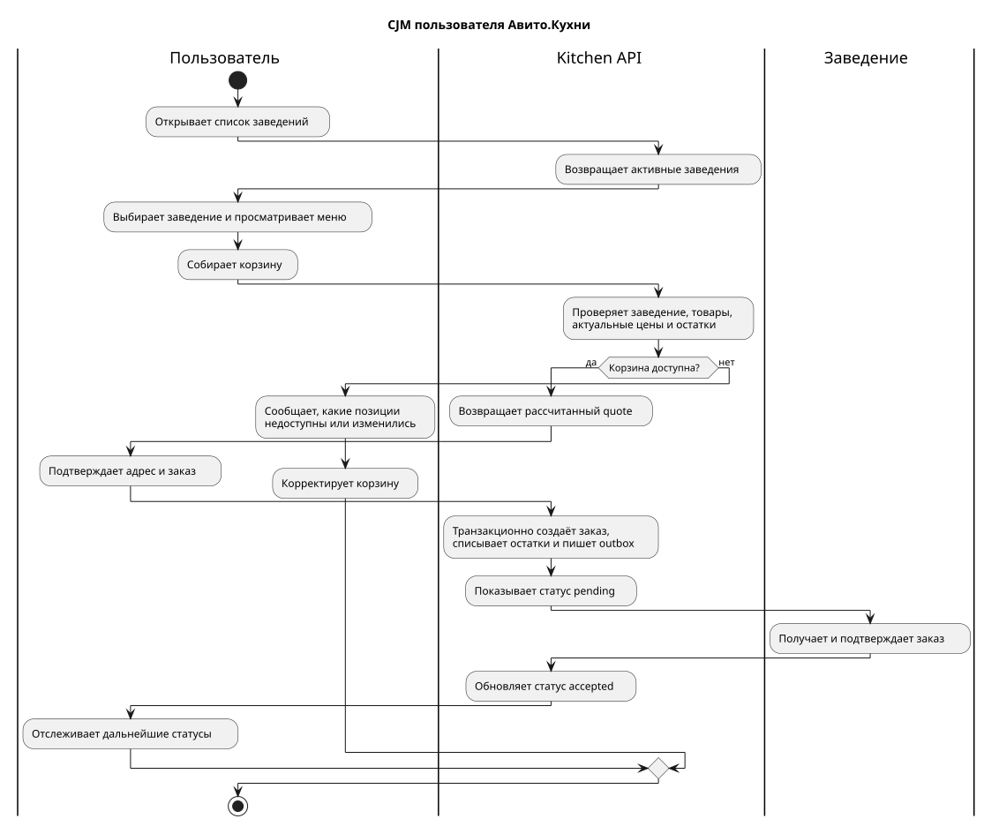
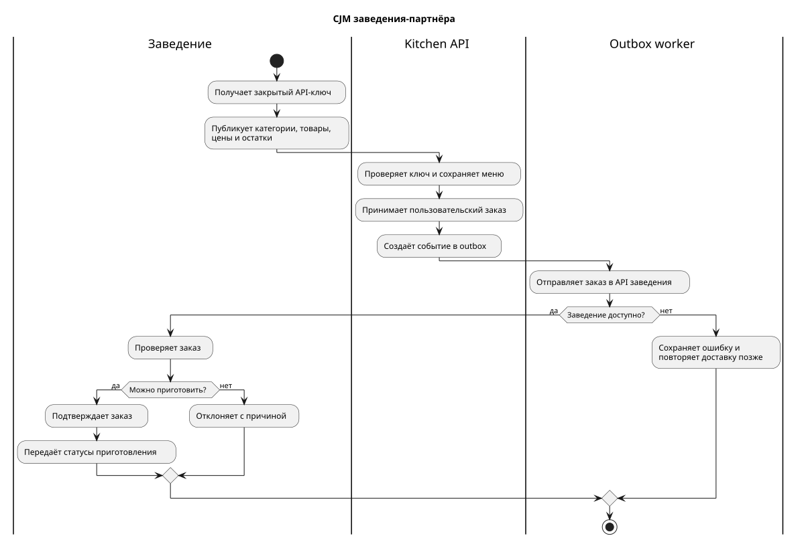
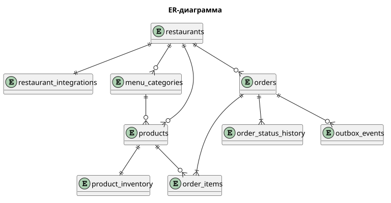

# Авито.Кухня — Backend MVP

MVP API для просмотра меню, оформления заказов и интеграции с заведениями.
Репозиторий содержит основной сервис и отдельный сервис демонстрационного кафе.

## Быстрый запуск

Требования: Go 1.26+, Docker Desktop с Docker Compose.

```bash
docker compose up --build -d
```

После запуска:

- Kitchen API: `http://localhost:8080`
- Demo Restaurant: `http://localhost:8081`
- PostgreSQL: `localhost:5432`

Проверка:

```bash
curl http://localhost:8080/health/ready
curl http://localhost:8080/api/v1/restaurants
```

Демонстрационное заведение при старте самостоятельно публикует меню. Спецификации
находятся в `api/openapi.yaml` (Kitchen API) и
`api/demo-restaurant-openapi.yaml` (входящий API заведения).

## Основной сценарий

1. Клиент получает список заведений и меню.
2. `POST /api/v1/orders/quote` проверяет актуальные цены и остатки.
3. `POST /api/v1/orders` с `X-User-ID` и `Idempotency-Key` создаёт заказ.
4. В одной транзакции сохраняются заказ, снимки позиций, история, изменение
   остатков и outbox-событие.
5. Worker доставляет заказ отдельному сервису заведения.
6. Заведение проводит заказ через статусы `accepted`, `preparing`, `ready`,
   `delivering` и `delivered` через партнёрский API.
7. Клиент получает актуальный статус через `GET /api/v1/orders/{id}`.

## CJM

### Пользователь



Исходник: [`docs/cjm/customer.puml`](docs/cjm/customer.puml).

### Заведение



Исходник: [`docs/cjm/restaurant.puml`](docs/cjm/restaurant.puml).

## Пример создания заказа

Сначала получите UUID товара из меню:

```bash
curl http://localhost:8080/api/v1/restaurants/11111111-1111-1111-1111-111111111111/menu
```

Затем подставьте его в запрос:

```bash
curl -X POST http://localhost:8080/api/v1/orders \
  -H "Content-Type: application/json" \
  -H "X-User-ID: 22222222-2222-2222-2222-222222222222" \
  -H "Idempotency-Key: example-1" \
  -d '{"restaurantId":"11111111-1111-1111-1111-111111111111","deliveryAddress":"Самара","items":[{"productId":"PRODUCT_UUID","quantity":1}]}'
```

## Архитектура

Основное приложение реализовано как модульный монолит. Каталог, заказы,
остатки, HTTP-транспорт и интеграции разделены пакетами. Demo Restaurant —
самостоятельный сервис и контейнер.

Такой вариант сохраняет простые локальные транзакции для критического сценария
создания заказа, но уже демонстрирует межсервисную доставку, retry и
идемпотентность. При росте нагрузки модули каталога и заказов можно выделить в
сервисы, заменив локальные транзакции событиями и Saga.

### C4 Level 2 — контейнеры


Исходник: [`docs/architecture/c4-container.puml`](docs/architecture/c4-container.puml).

Дополнительные архитектурные диаграммы:

- [C4 Level 1 — контекст](docs/rendered/c4-context.svg)
- [ER-диаграмма](docs/rendered/database.svg)
- [Sequence создания заказа](docs/rendered/order-sequence.svg)

Отрендеренные SVG и PNG находятся в `docs/rendered`. Для повторной генерации
запустите `powershell -ExecutionPolicy Bypass -File scripts/render-diagrams.ps1`.
Скрипт использует закреплённую версию PlantUML в Docker. На системах с `make`
доступна короткая команда `make diagrams`.

## Модель данных

- `restaurants` и `restaurant_integrations` — заведение и параметры интеграции;
- `menu_categories`, `products`, `product_inventory` — меню и остатки;
- `orders`, `order_items` — заказ и неизменяемые снимки его позиций;
- `order_status_history` — аудит переходов статуса;
- `outbox_events` — надёжная передача заказа заведению.

Деньги хранятся в копейках как `bigint`. UUID используются как внутренние
идентификаторы. Внешние идентификаторы заведений отделены от внутренних.



Исходник: [`docs/architecture/database.puml`](docs/architecture/database.puml).

## Надёжность

- `Idempotency-Key` защищён уникальным ограничением и advisory lock;
- остатки читаются через `SELECT ... FOR UPDATE`;
- итоговая сумма всегда рассчитывается сервером;
- заказ и outbox-событие создаются атомарно;
- worker использует `FOR UPDATE SKIP LOCKED` и повторяет неуспешные доставки;
- переходы статусов проверяются конечным автоматом;
- API-ключ партнёра хранится в виде SHA-256 хеша.

## Команды разработки

```bash
go test ./...
go test -count=1 -tags=e2e ./tests/e2e
golangci-lint run ./...
powershell -ExecutionPolicy Bypass -File scripts/render-diagrams.ps1
docker compose up --build -d
docker compose logs -f
docker compose down
```

## Упрощения MVP

- пользовательская аутентификация находится за пределами задания;
- `X-User-ID` считается доверенным заголовком внешнего gateway;
- оплаты, курьеров и геокодирования нет;
- worker выполняется в процессе основного API;
- исходящая связь с демонстрационным заведением находится во внутренней Docker-сети;
- полноценное управление секретами заменено переменными окружения.
